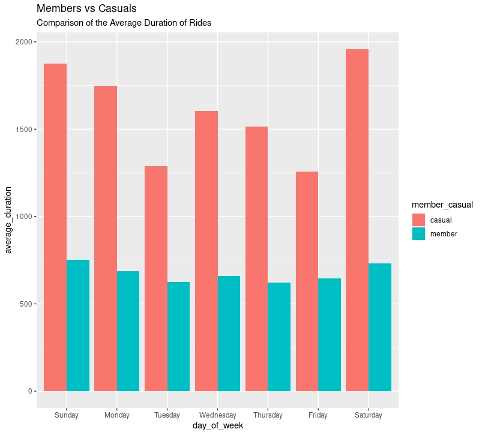

# Introduction
Through the Google Data Analytics Professional Certificate course offered by Coursera, I have been learning about the six stages of the data analysis process (ask, prepare, process, analyze, share, & act), and how to use tools such as SQL, Tableau, and R to gather insights from data. With what I have learned throughout the course, I will be completing an analysis on the Cyclistic Case Study showing the process step by step.

# Background
For this case study, I will be assuming the role of ‘Jr. Data Analyst’ at Cyclistic, a bike-share company based in Chicago that offers over 6,000 bikes at 800+ docking stations spread across Chicago. They currently offer classic bikes and electric bikes for use and have two customer segments: Casuals and Members. Casuals are customers who either buy a single-trip pass or a day pass, and Members are customers who buy annual memberships. My goal is to design marketing strategies aimed at converting casual riders into annual members. I will do this by focusing on finding how annual members and casual riders use Cyclistic bikes differently.

# Ask
Cyclistic’s finance analysts have concluded that annual members are much more profitable than casual riders. The director of marketing and my manager, Moreno believes that maximizing the number of annual members will be key to future growth. Moreno wants to convert the casual riders into members rather than target all-new customers. To help them complete this goal, I have been asked to find “How do annual members and casual riders use Cyclistic bikes differently?”.

# Prepare
I will analyze Cyclistic's historical bike trip data for the first quarter of 2022. This dataset, collected by Cyclistic, is known for its reliability and lack of bias. It is stored in the company's database, with separate CSV files available for each month and year. To conduct this analysis, I have stored the 3 CSV files, each corresponding to a different month of the first quarter of 2022, on my local drive. You can access the Cyclistic dataset [here](https://divvy-tripdata.s3.amazonaws.com/index.html).

# Process
To start, I utilize R through Posit Cloud to merge, clean, and manipulate the data, preparing it for analysis. This process entails several essential steps, including:

Uploading the Cyclistic data from January 2022, February 2022, and March 2022 into Posit Cloud and  merging them into a single dataframe. I then verify that all observations are transferred to the new dataframe properly. I also add the ride_length_secs, date, month, day, year, day_of_week, and hour columns so that I can use these for my analysis. I then use the str() function for my dataframe to check if the data types of the columns are correct. I then change the ride_lengh_secs to a numeric data type so that I can run calculations on the data later on. I then clean the data by removing NA values, duplicate rows, columns that will not be used for the analysis, and values less than 0 for the ride_length_secs column.

# Analysis
With the data processing phase completed, I begin with my analysis focusing on how members and casuals differ when using Cyclistic bikes.
To start, I compared the amount of rides and the average duration (in seconds) for rides between the annual members and casual riders.

The graph above clearly shows that there is a large difference between the usage of Cyclistic bikes between the members and casuals, where the casuals more than double in the average duration for rides each day of the week.

To show this gap better I used the ggplot package to create a visualization of the data from R.

The graph above clearly shows the overwhleming difference in usage between members and casuals for Cyclistic bikes. This graph also shows a trend of where Cyclistic bikes are used more on the weekdays. This can potentially be because people use Cyclistic bikes for a means of commuting to and from work or school.

With another visualization, the comparison for the average ride length between members and casuals indicate that casual users tend to have a longer average ride duration compared to members.

The graph above shows a trend opposite to the number of rides visualization which led to me making another visualization that shows the number of rides for members and casuals at each hour of the day.

The graph above shows that there are two peaks in ride frequency for members, one beginning at 8:00 A.M., which is the time many people usually commute to work. The second peak in ride frequency is at 5:00 P.M., which is the end of the workday for many people. This graph also shows that for casuals, there seems to be an upward trend throughout the day and downward trend towards the night time. With this, we can assume that casual members do not use Cyclistic bikes for their commute to work, but rather for fun or impromptu activities. This analysis is further supported with the decline in usage after 5:00 P.M. likely due to the sun setting.

# Share
**How do annual members and casual riders use Cyclistic bikes differently?**

With the data analysis I have conducted on the Cyclistic data of the members and casuals, I can make a conclusion on the difference between the members and casuals.
Members use Cyclistic bikes much more often, which can be seen clearly with the comparison between the number of rides between members and casuals. The members average ride durations also lasted much shorter but the average ride duration were consistent through the weekday, since the members are likely using for commute to and from work. Casuals on the other hand, use Cyclistic bikes less often, but for a longer period of time. The only noticeable trend by casuals is the consistent upward trend of the number of rides until 5:00 P.M., followed by a downward trend likely due to the sun setting. This likely means that casuals use Cyclistic bikes moreso for fun and leisure activities rather than for commute to and from work.

# Act
With the data analysis I have completed on the Cyclistic data of the members and casuals, the marketing department should use strategies to convert these casuals to members. One strategy could involve offering membership options with reduced rates for Cyclistic bike usage between 10:00 A.M. and 5:00 P.M. Another approach could entail offering a promotion where two people signing up for membership together receive a discount. Additionally, a marketing strategy could involve offering exclusive benefits to members that casual riders do not have access to when using the bikes.
